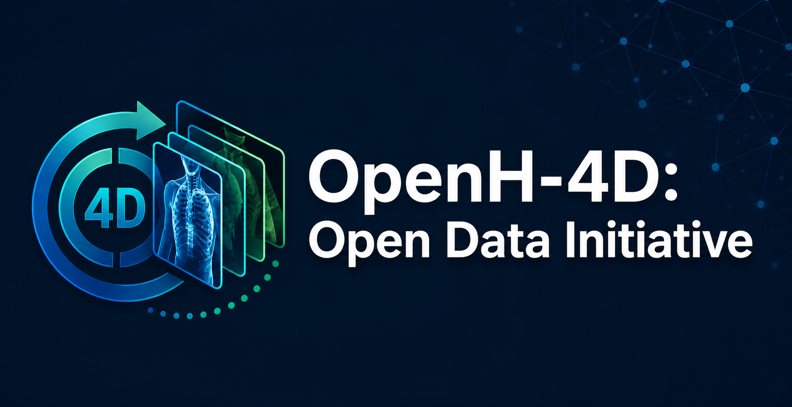

<div align="center">



# Open-H-4D

[](LICENSE)
[](https://creativecommons.org/licenses/by/4.0/)

*A collaborative collection of 4D cardiac and respiratory imaging, for training foundation models of physiological motion.*

</div>

---

## About

Open-H-4D is an [Open-H.org](https://open-h.org) initiative to collect **4D data
from at least 20,000 subjects** — patient details together with sequences of 3D
images capturing cardiac and/or respiratory motion. Building on the
OpenH-Embodiment video collection effort, it aligns leading institutions around a
single openly licensed corpus of 4D CT, MRI and ultrasound.

The collected datasets will be freely available for academic and commercial use,
and used to train and validate physics-informed and generative AI models of
physiological motion. Beyond motion modelling, the data suits detecting imaging
biomarkers that inform patient-specific physics parameters, training diagnostic
models that incorporate physiological data, and simulating clinical signals such
as ECG and spirometry.

NVIDIA sponsors Open-H-4D by pre-processing all submissions and enabling free,
open access to the dataset, foundation model weights and training code on project
completion.

Released on Hugging Face under **CC BY 4.0**.

## This repository

Tooling for preparing and checking an Open-H-4D contribution, and the normative
specification of what a submission looks like.

| | |
|---|---|
| [`skills/open-h-4d-shared/layout-spec.md`](skills/open-h-4d-shared/layout-spec.md) | **The submission layout specification.** Start here. |
| [`skills/`](skills/) | Agent skills for organizing, converting, verifying and evaluating submissions |
| [`src/openh4d/`](src/openh4d/) | The Python package every skill invokes |
| [`examples/`](examples/) | Three worked examples that each build a complete submission |

## How to participate

1. **Review the RFP** — [Call for Proposals](assets/Open-H-4D_Call_For_Proposals.pdf)
   for scope, eligibility, data requirements and review criteria.
2. **Submit a proposal** — describing the data you would contribute, per RFP §8,
   via the [submission form](https://forms.gle/Y9pUAHhG7xYCWDoD7).
3. **Prepare your data** — using the tooling here. The
   [layout specification](skills/open-h-4d-shared/layout-spec.md) is the contract.
4. **Co-author the release** — contributing teams are named co-authors on both
   the dataset publication and the follow-up foundation-model publication, and
   receive early access to evaluation checkpoints and the dataset itself.

## Scope

4D **CT, MRI or ultrasound** of:

- **cardiac motion**
- **lung respiratory motion**

The organizers anticipate expanding later to other modalities — dynamic X-ray
fluoroscopy — and other anatomies and functions, such as brain perfusion.

Corpus targets: a 40/40/20 split across CT, MRI and ultrasound, and 50/50 between
lung and cardiac. These guide steering-group priorities; they are not a bar any
individual submission is measured against.

## Submission layout in one screen

One 4D study per directory, named by patient identifier with a letter suffix that
always starts at `A`:

```
<submission-root>/
├── README.md              the data card (Hugging Face renders it)
├── LICENSE                CC BY 4.0
├── manifest.json          generated index
├── STAN-0001A/            one 4D study
│   ├── study.json
│   └── t0000.nii.gz …     one volume per time point
│       (or dicom/t0000/ … per-phase DICOM, or a single image4d.nii.gz)
├── STAN-0001B/            a second study from the same patient
├── STAN-0001_ehr/         auxiliary patient information
│   └── patient.json       demographics, disease state, vitals, reason for scan
└── STAN-0002A/ …
```

Images are `.nii.gz` or DICOM. The letter suffix starts at `A` even for a patient
with one study, so adding a second later never renames the first. The full rules,
including the sidecar schemas and the RFP conformance thresholds, are in the
[layout specification](skills/open-h-4d-shared/layout-spec.md).

## Quickstart

```bash
git clone https://github.com/open-h/open-h-4d
cd open-h-4d
uv sync
python scripts/bootstrap_skills.py      # makes the skills discoverable
```

Build a complete example submission — no network, a few seconds:

```bash
uv run python examples/synthetic-4d/build_example.py --out /tmp/oh4d-synthetic
```

Check your own data:

```bash
uv run python -m openh4d.verify_layout <your-submission-root>
```

Exit 0 means compliant.

### Preparing a submission

| Starting point | Command |
|---|---|
| A DICOM export | `python -m openh4d.dicom_index <src> --out plan.json` then `python -m openh4d.organize_dicom --plan plan.json --out <root> --id-prefix <PREFIX> --apply` |
| Organized DICOM | `python -m openh4d.convert_dicom <root>/<STUDY>` |
| NRRD, Slicer sequence, or per-phase NIfTI | `python -m openh4d.convert_nrrd <src> --out <root>/<STUDY>` |
| Anything, to check it | `python -m openh4d.verify_layout <root>` |

`dcm2niix` is downloaded, version-pinned and cached automatically on first use.

If you work with an AI coding assistant, the [`skills/`](skills/) directory walks
through each of these interactively, including the parts that need a human
judgement rather than a command.

## Setup

Uses [`uv`](https://docs.astral.sh/uv/) for environment and dependency
management. Install once:

```bash
curl -LsSf https://astral.sh/uv/install.sh | sh          # Linux / macOS
powershell -c "irm https://astral.sh/uv/install.ps1 | iex"   # Windows
```

Then `uv sync` for the runtime, or `uv sync --extra test` to run the tests. Plain
pip works too:

```bash
pip install -e .
```

**Windows, Linux and macOS are all supported natively.** No WSL, no compiler, no
GPU.

### Skill discovery

`python scripts/bootstrap_skills.py` makes the skills in `skills/` visible to
Claude Code by populating `.claude/skills/`. It is idempotent, needs no admin
rights and no Developer Mode, and is required once per clone — `.claude/skills/`
is generated rather than committed, because a committed copy cannot survive a
native-Windows clone intact. See [`AGENTS.md`](AGENTS.md).

## De-identification

All human-subject data must be de-identified to **HIPAA Safe Harbor** standards
or equivalent (RFP §10). The obligation is the contributing institution's.

**The tooling here verifies de-identification; it does not perform it.** Use a
mature implementation — RSNA CTP, or any DICOM PS3.15 Basic Application Level
Confidentiality Profile implementation — and then check:

```bash
python -m openh4d.phi_scan <source-dir>
```

On top of that, Open-H-4D adds defense in depth: `organize_dicom` refuses to run
on obviously identified data, and any DICOM it retains is stripped to a
conservative tag allowlist. Neither is a substitute for de-identifying properly.

The identifier crosswalk is written **outside** the submission by design, and the
verifier rejects any submission containing one. See
[`skills/open-h-4d-shared/phi-checklist.md`](skills/open-h-4d-shared/phi-checklist.md).

## Key dates

| Milestone | Date |
|---|---|
| RFP released | September 27, 2026 |
| Proposal submission deadline | November 1, 2026 |
| Data collection window | October 1 – December 31, 2027 |
| Data cleanup and standardization | January 1 – February 1, 2027 |
| Model training and validation | February 1 – March 15, 2027 |
| First public release | April 2027 |

> **These dates are inconsistent in the published RFP and are not settled.**
> Collection runs through December 2027 while cleanup, training and release all
> fall in early 2027, and §6 separately promises release "no later than March
> 2027" — which contradicts the April date independently of the year problem.
> Confirm with the organizers before relying on any of them.

## Steering group

| Role | Name | Affiliation |
|---|---|---|
| Academic Lead | Alison Marsden, PhD | Stanford |
| Academic Lead | Paul Segars, PhD | Duke University |
| Generative AI Lead | Can Zhao, PhD | NVIDIA |
| Industry Lead | Mark Palmer, MD, PhD | Ansys, part of Synopsys |
| Clinical Lead | Matthew Jolley, MD | |
| Co-Chair | Mathias Ubernath, PhD | |
| Co-Chair | Stephen Aylward, PhD | NVIDIA |

Founding members: Ryan Moore, MD (Cincinnati Children's Hospital Medical Center);
Jeff Bodner, PhD (Medtronic).

## Development

```bash
uv sync --extra test
python scripts/bootstrap_skills.py
uv run ruff format --check . && uv run ruff check .
uv run pytest tests/ -m "not heavy"      # ~30 s, no network
uv run pytest tests/ -m heavy            # the real datasets, ~3.3 GB of downloads
```

Continuous integration runs the light suite on Windows, Linux and macOS for every
pull request — "runs natively on all three" only stays true if it is checked.

## Contact

- **Technical questions** — [openh.data+4d@gmail.com](mailto:openh.data+4d@gmail.com)
- **Administrative questions** — [saylward@nvidia.com](mailto:saylward@nvidia.com)

## License

Code in this repository is licensed under the [Apache License 2.0](LICENSE). The
released dataset is licensed under
[CC BY 4.0](https://creativecommons.org/licenses/by/4.0/).
